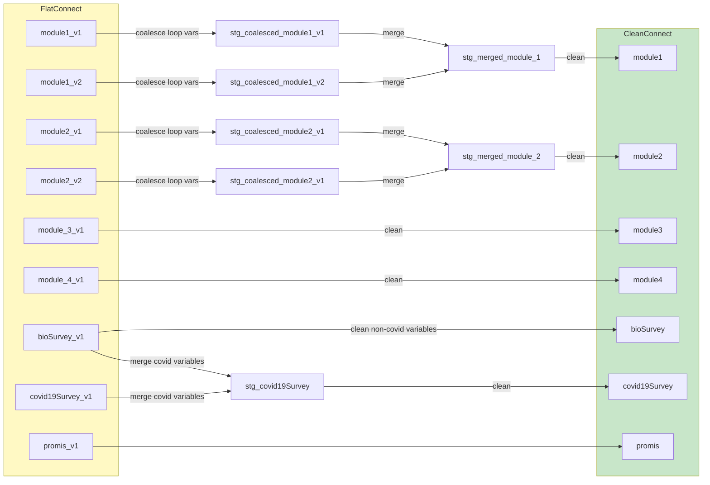
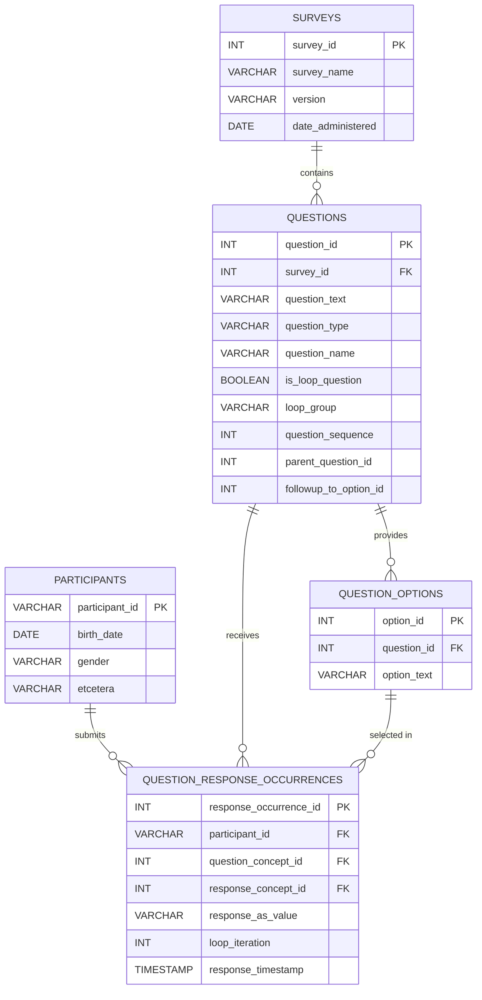
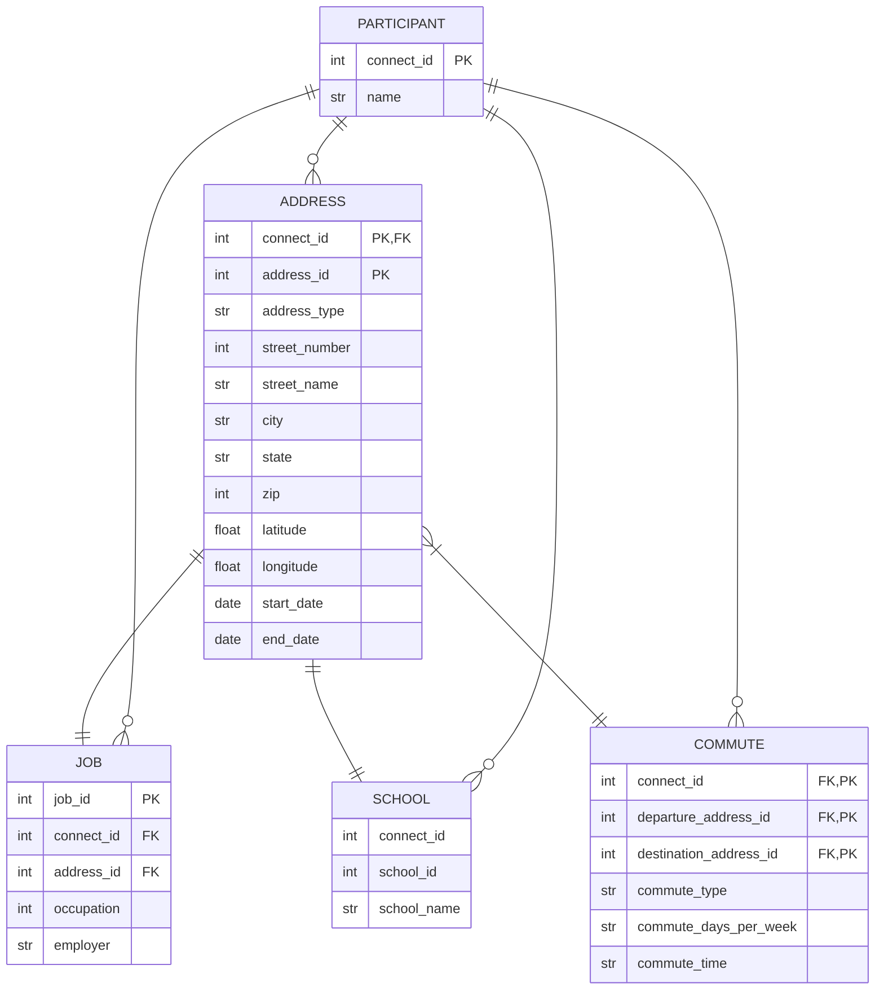

# pr2-documentation
Documentation and Issue-tracking for the PR2 Data Pipeline.

- **Issue Tracking:** All [Issues](https://github.com/Analyticsphere/pr2-documentation/issues) will be created in this repo and tracked in the [pr2 GitHub Project](https://github.com/orgs/Analyticsphere/projects/15).
- **Transformations:** Transformation code will be developed/maintained here: [Analyticsphere/transformation](https://github.com/Analyticsphere/pr2-transformation)
- **Orchestration:** Airflow DAGs will be developed/maintained here: [Analyticsphere/pr2-orchestration](https://github.com/Analyticsphere/pr2-orchestration)

Core logic of the transformations will be implemented in Python, but the Python code will render SQL which will be executed in BigQuery. 
## High-level dataflow diagram

## Dataflow diagram for cleaning transformations

## [DRAFT] A sketch of a response-centric relational data model for Connect surveys

## [DRAFT] Diagram of proposed data structure changes to *Module 4: Where you live and work*

