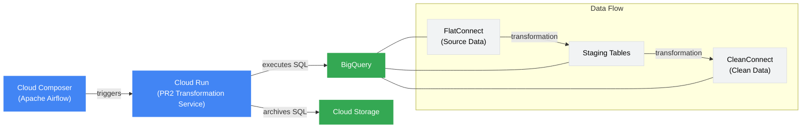
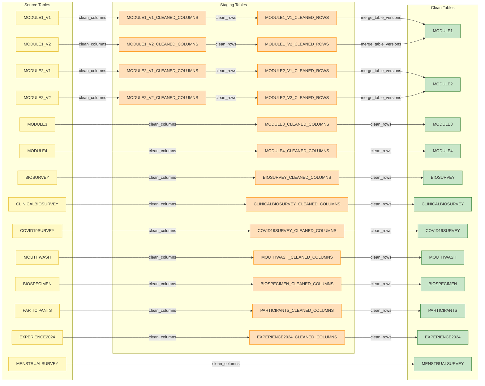
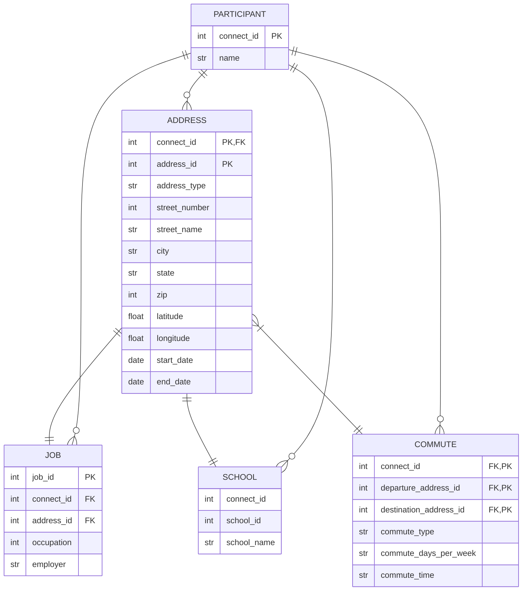

# pr2-documentation
Documentation and Issue-tracking for the PR2 Data Pipeline.

- **Issue Tracking:** All [Issues](https://github.com/Analyticsphere/pr2-documentation/issues) will be created in this repo and tracked in the [pr2 GitHub Project](https://github.com/orgs/Analyticsphere/projects/15).
- **Transformations:** Transformation code will be developed/maintained here: [Analyticsphere/pr2-transformation](https://github.com/Analyticsphere/pr2-transformation)
- **Orchestration:** Airflow DAGs will be developed/maintained here: [Analyticsphere/pr2-orchestration](https://github.com/Analyticsphere/pr2-orchestration)

Core logic of the transformations will be implemented in Python, but the Python code will render SQL which will be executed in BigQuery. 

## High-level dataflow diagram

# PR2 Transformation Architecture

## System Overview

The PR2 transformation architecture is a serverless ETL pipeline which is built on Google Cloud Platform that transforms Connect data from its raw form to a clean, standardized format for research purposes.

## Architecture Diagram
> *Note:* This currently just includes the cleaning transformations, not-deidentification or aggregations. Each additional transformation should be a new endpoint in the API and should be called from a new "task" in the Airflow DAG.

## First Principles

The following first principles are used to guide development decisions:

- **Unidirectional data flow**: Raw → clean | PII → de-identified | granular → aggregated
- **Modularity**: Small, discrete functions optimized for readability over efficiency
- **Separation of concerns**: Group transformations by type, not by table (e.g., column-level, row/value-level, table-level)
- **Parallelization**: Process multiple tables simultaneously
- **Configuration**: Parameterize constants and avoid hardcoding changeable elements
- **Extensibility**: Design to accomodate arbitrary future requirements, avoid one-off solutions
- **SQL-first**: Generate SQL in python and execute in BigQuery via client library
- **Auditiability and data provanence**: Archive SQL in GCS prior to execution for debugging and analyzing data provanance
- **Serverless**: REST API endpoints for processing. Pass parameters via JSON from orchestrator
- **Centralized orchestration**: Airflow for dependency management, parallelization, and scheduling
  
## Core Components

### Cloud Composer (Apache Airflow)
- Orchestrates the entire ETL workflow
- Schedules and triggers transformation steps in sequence
- Manages dependencies between transformation tasks

### Cloud Run (PR2 Transformation Service)
- Hosts the transformation API endpoints
- Processes transformation requests from Airflow
- Generates SQL for BigQuery execution

### BigQuery
- Functions as both source and destination for data
- Executes the transformation SQL queries
- Houses three key datasets:
  - **FlatConnect**: Original source data
  - **Staging Tables**: Intermediate processed data
  - **CleanConnect**: Final cleaned data

### Cloud Storage
- Archives generated SQL queries for audit purposes
- Provides transparency for transformation logic

## Data Flow

The transformation process follows a simple flow:

1. **Orchestration**: Airflow DAG triggers API calls to the Cloud Run service
2. **Transformation**: The service generates and executes SQL in BigQuery:
   - Source data (FlatConnect) → Column cleaning → Row cleaning → Table merging
   - Intermediate results are stored in staging tables
   - Final results are stored in CleanConnect
3. **Auditing**: Generated SQL is archived in Cloud Storage

## API Endpoints

The PR2 Transformation Service exposes the following RESTful endpoints:

| Endpoint | Method | Description |
|----------|--------|-------------|
| `/heartbeat` | GET | Verifies service health |
| `/clean_columns` | POST | Standardizes column names |
| `/clean_rows` | POST | Transforms row values |
| `/merge_table_versions` | POST | Combines multiple table versions |

## Transformation Steps

### 1. Clean Columns
- Standardizes naming conventions for loop variables
- Converts column names to lowercase (except Connect_ID)
- Standardizes version tags by placing them at the end of column names
- Splits or merges columns as needed

### 2. Clean Rows
- Converts binary "0"/"1" values to standardized concept IDs
- Handles array unwrapping for singleton values

### 3. Merge Table Versions
- Performs full outer joins on tables with multiple versions
- Uses COALESCE for combining common columns
- Preserves columns unique to either source table

This architecture provides a clean separation between orchestration (Airflow), processing logic (Cloud Run), and data storage (BigQuery), enabling a maintainable and scalable approach to ETL processing.
## Dataflow diagram for cleaning transformations

## Transformation Steps
- clean_columns:
    - fix naming conventions for loop variables
    - convert collumn names to lower case
    - standardize use of version tag, e.g., '_v2', by putting it at the end of the column names
    - split columns that require splitting
    - merge columns that need merging 
- clean_rows:
    - ensure that binary responses have concept ids for yes/no rather than 0/1
    - ensure that there are now values that should be singletons that are wrapped in brackets like an array
- merge_table_versions
    - join tables that have multiple versions
    - take care to use coalesce appropriately to combine mutual columns
    - take care to include columns unique to either source table in the target table

# Thoughts on the future state of PR2:

## Could we do better a response-centric relational data model? Yes!
> This diagram does not represent a "fully-cooked" data model for the Connect data. It is a conceptual sketch that should be developed further through discussion with stakeholders. The nomenclature can be adjusted to use the terminology from our existing data dictionary as needed ("primary source", "secondary source", etc.). I suggest this type of normalized relational data model as a middle layer between our operational (raw) data and the data that are "curated" for the end-user. 

## [DRAFT] Diagram of proposed data structure for *Module 4: Where you live and work* data mart.
> This is also just a conceptual sketch, not a fully developed data model. 

